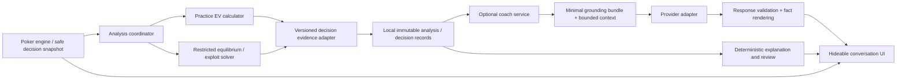

# Solver-grounded conversational coaching for OpenPoker Lab

Architecture decision record · 2026-10-07 · architecture only

## Decision

Keep the working poker engine, calculators, restricted river CFR solver, opponent store, and deterministic explanation path. Add a versioned evidence boundary between calculation and coaching, then an optional asynchronous conversation service. The coach explains authoritative results; it never supplies poker calculations, selects strategy, or modifies gameplay.

The best first implementation slice is **a validated, immutable `CoachDecisionAnalysis` contract and a pure adapter from existing `practice-ev-v3` results**. It needs no model, API key, new endpoint, persistence migration, or frontend change. The initial implementation prompt is in `luna-first-slice.md`; the first slice is now implemented in this PR as a separate evidence contract and practice adapter.

## A. Current architecture assessment

### Baseline and inspection

The project-local `openpoker` checkout is on `feature/exploit-solver` at `a75697d`; its cached `origin/main` is older still. Do not implement against that checkout without updating or using a separate checkout of current main.

GitHub main was verified at **`48f6803e474ce514c54da8916dd61cef57fd0ac4`**, “Validate and strengthen the restricted river CFR solver (#20).” The earlier integrated release checkout at `a2992fc` supplies the unchanged application files: its tracked blob IDs match the current GitHub tree for every Python application module except `solver.py`, and for the existing test and UI files. The new solver, equilibrium interface, validation tests, and scope document were read directly at the pinned GitHub commit. A local inspection copy in this architecture run's workspace lives in `architecture/review-baseline`; it is an inspection/test fixture, not an implementation branch or the full repository.

Inspected: cards/ranges/evaluator, equity, all betting mechanics, practice calculation and recording, solver and exploit adapter, shared contracts, model/SQLite boundaries, deterministic explanations and personalities, HTTP handlers/security/concurrency, frontend play/review flows, configuration, existing tests, CI, and architecture/scope documentation.

### Existing components and reuse

| Component | Verified behavior | Decision |
| --- | --- | --- |
| `cards.py`, `equity.py` | Canonical two-character cards, weighted range expansion/blockers; seeded Monte Carlo, split-pot shares, exact heads-up river equity | Reuse; the model never evaluates cards or estimates probabilities |
| `game.py:Game` | 2–6 players, integer stacks, blinds/button, streets, legal actions, action log, cumulative short-all-in reopening, side pots and odd-chip settlement | Reuse; keep game authority here |
| `practice.py` | Seat-zero hero, safe visible state, automatic non-hero check/call/fold; saved inputs and reproducible `practice-ev-v3` estimates | First evidence producer; preserve calculations |
| `solver.py` | Full-traversal vanilla CFR, simultaneous regret updates, reach-weighted average strategies, exact compatible deals and information-set best responses | Reuse only inside its stated abstraction |
| `equilibrium.py` | `solve_equilibrium`, `InfoSet`, explicit `Action.amount`, `strategy_at`, legal actions and profile gap | Preferred public equilibrium boundary; do not expose CFR node letters or regrets to coaching |
| `exploit.py` | Separate reference/model policies; immutable opponent snapshot, confidence blending and documented IP node locks; OOP root/facing-bet outputs | Later producer adapter; retain assumptions and best-response semantics |
| `contracts.py` | Frozen typed contracts, serialization, probabilities/finite-number validation, stable analysis IDs, baseline/exploit separation | Add new additive coaching contracts here; preserve existing contracts |
| `explanations.py` | Recommendation supplied upstream; exact EVs/evidence/caveats; short/normal/beginner deterministic rendering | Reuse fallback and glossary; correct semantic labeling at the new boundary |
| `personalities.py` | Protected-fact fingerprints and deterministic voices; disabled optional adapter never calls provider | Preserve voices; current text-only provider is insufficient for validated conversations |
| `models.py:Store` | Transactional SQLite observations, analyses, sessions and decisions; historical inputs/model snapshots; JSON export | Reuse storage; later add records rather than replace it |
| `server.py` | Loopback stdlib threaded HTTP, Host/Origin checks, JSON writes, CSP, global game lock and two-slot request semaphore | Keep protections; later separate coach work from gameplay locks/admission |
| `web/app.js`, HTML/CSS | Existing hideable coach after actions, voice selector, Blind Play, saved hand review | Extend existing panel and review; no frontend-framework rewrite |

### Material limitations and small necessary changes

1. **Practice estimates are not CFR solutions.** The practice baseline uses an illustrative 45% fold assumption; one-hot policies created by `build_coach_explanation` are argmax recommendations, not equilibrium mixing frequencies. Exact river showdown equity does not make its action EVs a solved strategy. Label producer and policy semantics explicitly.
2. **The solver supports heads-up river, one fixed bet size, check/bet/fold/call, no raises, stack caps, future streets or rake.** Normal multiway practice play cannot be silently mapped into it. A later supported-state adapter must validate abstraction compatibility and explicit ranges. Outside scope, return estimates or unavailable analysis with reasons.
3. **EV meanings differ.** Practice is incremental chips from the current decision; CFR uses utility relative to half the initial pot. Practice explanation `ev_differences` means action minus best estimated action; exploit output means modeled-opponent EV minus reference-opponent EV. Do not reuse either as universal player regret. Attach basis/comparison labels and calculate choice loss only within identical conditions.
4. **Raise-size mismatch exists.** Practice estimates the minimum legal raise, while `Game.act` accepts every legal street total. `decision_event` stores only the action name and compares any raise with that minimum-raise EV. The new evidence must identify `raise:min` explicitly. Future choice evaluation must record the actual amount and report larger raises as unassessed until an authoritative calculator supports them. Do not silently fix the poker formula during the first slice.
5. **Current recording is incomplete for a full timeline.** Hero private cards, board, actor/button, stacks, contributions, legal details and ranges are saved; decision events do not save the chosen raise amount, folded flags or the action-history prefix. The live `Game.log` contains names and action amounts but older persisted decision inputs do not. A later additive capture change must record a safe pre-action snapshot and exact chosen action. Historical absence stays unknown.
6. **A current “session” is one hand.** `/api/game` uses the same ID for the in-memory hand and `Store.sessions`. Real multi-hand coaching needs a separate study-session identity and hand membership, preserving legacy session retrieval.
7. **Identity and atomicity need care.** `save_decision` has a database UUID but returns an event without that UUID. Live games have no explicit revision. The handler calculates under a global lock, mutates the game, then saves: database failure can leave gameplay advanced without a decision record. Before dependable async integration, introduce additive stable decision IDs/revisions, idempotent accepted-action handling, and prepare/save/commit orchestration under the hand lock. A save failure must leave the action retryable without duplicate mutation. No event-sourced engine rewrite is required.
8. **Existing HTTP/UI behavior is synchronous.** All POSTs share two work slots, `/api/act` calculates while holding the global game lock, the browser has one mutable `game` variable, and there is no stale-response guard. AI must never execute in this path. Even AI off currently still performs deterministic practice analysis; retain that behavior initially and optimize separately.
9. **Current explanation provenance is too broad for this feature.** It labels fields `solver_output` even for practice estimates; legacy `analysis_from_dict` also drops richer assumption/best-response metadata. The new adapter copies authoritative producer fields directly and gives accurate provenance rather than round-tripping through that lossy compatibility path.
10. **The equilibrium wrapper is read-only by convention, not deeply immutable.** It retains the mutable result dictionary. Coaching must copy scalar/tuple facts at capture time and never retain or access its private `_result`/`_rows`. Its interface supplies frequencies and overall profile values/gaps, not per-decision action EVs, conditional reach or strategic causes. Unsupported values remain null.

## B. Proposed system architecture

Calculation owns recommendations, strategy distributions, EV comparison, uncertainty and decision ranking. The adapter owns faithful normalization, explicit source/basis, safe serialization and availability. The coach owns conversation intent, context, explanation depth, provider routing and validation. UI owns visibility and active selection; it cannot certify evidence or provide authoritative analysis to the coach.

Capture immutable pre-action information before gameplay advances. Analysis targets that snapshot, never a mutable live `Game`. Store old analysis as old analysis; reevaluation creates a new record with a link to the original. AI processing and rendering run independently of accepted actions and never hold a game/SQLite transaction lock while waiting on a provider.

Use existing Python modules and SQLite initially. Add a bounded executor and local request/conversation records when integration requires them. No microservices, vector database, agent framework, tool-executing poker model or external queue is justified now. CPython CPU-bound solver latency is a separate issue: reserve coach capacity independently and profile before choosing process workers for calculator work.

## C. Solver-to-coach analysis contract

`CoachDecisionAnalysis` is the canonical coaching boundary. Its exact first-slice dataclasses, serialization, validation, mapping and errors are specified in `luna-first-slice.md`; that prompt is authoritative for the slice. Do not modify `StrategyAnalysisResult` field meanings to make it fit.

| Field group | Owner and meaning |
| --- | --- |
| `ref` | Application hand/decision identity and revision; distinct from content-based analysis identity; null revision permitted only for historical data without a captured revision |
| `analysis_id`, `evidence_id`, versions | Preserve original producer ID; adapter fingerprint identifies the normalized evidence; schema, producer and opponent-model versions remain separate |
| `context` | Safe decision-time board/hero cards, pot with explicit basis, seat/button/contributions/legal context when available; never deck/other hole cards/names/notes |
| `legal_actions` | What the game permits, with amount convention and raise bounds |
| `modeled_actions`, `action_evs`, `baseline_action_evs` | What the producer actually evaluated; amounts are part of action identity; absent EVs are null, never fabricated zeroes |
| `reference_policy`, `modeled_policy` | Separately labeled policies; `illustrative_argmax` / `estimate_argmax` for practice and `equilibrium_mix` / `modeled_opponent_mix` for future supported producers |
| `recommended_action_id`, `baseline_recommended_action_id` | Copied producer recommendations; may be null when a frequency-only producer has no authoritative single recommendation |
| `ev_basis` | `incremental_decision_chips` or `half_initial_pot_utility`; values from different bases are not directly comparable |
| `opponent_ranges`, `opponent_assumptions` | Explicit range inputs and consumed modeled assumptions, with evidence counts/context/uncertainty; no actual villain cards or inferred range claims |
| `quality` | Separate opponent confidence/uncertainty, equity sampling error/exactness, and solver iterations/profile gaps and gap meaning; no composite “trust score” |
| `limitations`, `warnings`, `unavailable_fields`, `provenance` | Mandatory calculation caveats, missing-capability markers and source references; provenance must distinguish game state, analysis output, solver output, opponent estimates and application derivation |

Policies and estimates cover the **modeled** action set, not every legal variable sizing. Preserve full-precision values; rounding is only presentation. Unknown is null, missing historic data is explicit, and malformed/unsupported producer versions return typed adapter errors. Schema-major changes require migrations; later optional fields require reader compatibility tests and fingerprint-version discipline.

The first adapter does not calculate recommendations, EV deltas, regrets, range advantages or convergence. Its only derived values are amount normalization, one-hot representation of a supplied recommendation and evidence hashing. A later analysis-side evaluator can calculate choice loss as `max_modeled_EV - chosen_EV` only for the identical analyzed amount, basis, opponent policy and continuation assumptions. Do not penalize a valid mixed-strategy action merely for low frequency; small EV differences below meaningful numerical/sampling resolution should be “similar under this analysis,” not a confidently declared mistake. Monte Carlo equity standard error is not a validated action-EV interval.

For equilibrium results, obtain frequencies through `EquilibriumStrategy.strategy_at(InfoSet(...))`, explicit amounts through `legal_actions`, and iterations/profile gaps through public properties. The original scenario request retains board/ranges/initial pot. Do not derive per-action EVs from a root profile value or inject arbitrary one-hot recommendations. For locked/exploit results, unrestricted NashConv is profile exploitability, not a convergence certificate of the locked game. Conditional reach unavailable means no claim that an off-path strategy is meaningful.

## D. AI coach architecture

### Grounding and response validation

The server builds a small `GroundingBundle` from stored validated evidence. Each fact has an application-generated ID, analysis/evidence ID, JSON-pointer source, origin, exact value/unit and availability. Citations open that decision/fact in the application. Raw inputs supplied by the browser are never treated as certified solver facts.

The provider receives only a safe projection: active decision, a compact relevant hand timeline, consumed assumption facts, mandatory caveats and recent dialogue. It returns presentation content, not `CoachDecisionAnalysis`, recommendations, action values or updated strategy. Strong prompts alone do not establish grounding.

Use a structured answer with blocks: `fact` (known fact IDs rendered by the server), `interpretation` (text plus supporting fact IDs), `education` (concept ID plus text), and `unavailable` (reason plus required inputs/capability). Numerics, action recommendations, frequencies and quantitative comparisons in an answer must use server-rendered fact blocks/placeholders; allow no unreferenced numerical result in generated prose. References are validated against the pinned evidence set and IDs cannot resolve across hands without explicit context selection. Mandatory limitations and the visible analysis-kind label are rendered by the server outside model prose.

Validate schema/lengths/types, IDs, context binding, number/action claims, prohibited fields and unsupported solver-scope assertions before publication. Free-form interpretations cannot be proven correct by schema: label them as interpretation and evaluate them separately. Prefer a narrower deterministic answer if validation is uncertain. One bounded repair attempt is allowed, then deterministic fallback. Prompt-injection text in user questions/history is data, never authority to alter tools/facts or reveal hidden state.

For counterfactuals already represented by modeled actions, refer to existing facts. Changed hand, range, bet size or continuation requires an application-calculated new scenario linked to its parent. Return “not analyzed” until it exists. The LLM does not guess. General concepts such as range advantage may be taught without claiming the current analysis measured them.

### Provider boundary and routing

Use one provider protocol: `generate(request, *, deadline, cancellation) -> iterator[ProviderEvent]`. The request includes safe grounding, question, presentation settings, bounded dialogue and response-schema version. Events are transport deltas, a final structured answer or a typed provider failure. Provider-specific credentials, SDK shapes and tool-call syntax remain in the adapter. Do not extend the old `explain(payload, personality) -> str` path into strategic authority; preserve it for compatibility.

Default external AI to disabled. Explicit enablement configures one provider/model. Use a low-cost configured model for ordinary explanations and glossary questions; a stronger configured tier is optional for depth/teaching requests, with per-request/session token and spend ceilings. Provider fallback uses only a separately authorized/configured provider; never silently send data to another vendor. No automatic escalating agent chains.

### Context and depth

One local conversation per hand, with an explicit active decision. Every turn records its decision ID, evidence ID and immutable context revision. “Why?” and “simpler” remain bound to the previous answer unless the user changes selection. Context changes are explicit events, not guesses based on the newest game state.

Send the active evidence, up to a small fixed number of related decision summaries and recent turns within a hard input-token budget. Older dialogue becomes a bounded narrative summary; authoritative numbers and IDs are always regenerated from stored facts, never trusted from that summary. Local hand summaries contain selected decision IDs/status/estimated loss provenance; include another decision only when available and relevant. No model call is required to keep the ledger or rank decisions.

Use orthogonal presentation settings: `detail = short|normal|technical`, `audience = beginner|standard`, and the existing personality. Map current short/normal/beginner fallbacks compatibly; technical can disclose available methods/assumptions, not invented internal data. “Simpler” changes wording; “deeper” changes detail/context allocation. Neither changes analysis IDs, facts, policy or recommendation.

### Failure behavior

| Condition | Required behavior |
| --- | --- |
| AI off/no provider | No external calls; existing deterministic practice and review continue |
| Timeout/provider/network failure | End coach job; show a retryable status and deterministic explanation when evidence exists; no automatic unbounded retries |
| Invalid/schema/grounding failure | Discard response; at most one repair; fallback; never display rejected prose as certified content |
| Unsupported/unavailable analysis | Explain missing capability; concepts remain possible; no recommendation/EV fabricated |
| Weak or missing convergence | Keep measured diagnostics and caveats visible; no confident equilibrium-quality verdict; do not equate opponent confidence with convergence |
| Another action/hand/selection | Result can belong to its original history thread, but cannot replace the active card or current-decision coaching |
| Cancellation/disconnect | Stop delivery, best-effort cancel provider, bound outstanding work; late completion cannot revive cancelled request |
| Persistence failure | Coach failure does not mutate game; action orchestration must resolve local record consistency separately |

## E. API/UI contract

These are architecture-level shapes, not instructions to implement endpoints in the first slice. Preserve `/api/game`, `/api/act`, `/api/solve`, `/api/exploit`, `/api/explain`, `/api/session/{id}` and legacy responses. Add versioned routes and additive identity fields during integration.

| Interface | Boundary |
| --- | --- |
| `GET /api/v1/decisions/{decision_id}/analysis` | Fetch stored envelope/status using server-side IDs; status is `pending|ready|unavailable|failed`, with retryability and missing capability |
| `POST /api/v1/coach/requests` | `{client_request_id, conversation_id?, target:{hand_id,decision_id,evidence_id,state_revision}, question, detail, audience, personality}`; server validates target/evidence and deduplicates client request ID plus payload; return `202 {request_id,...binding}` |
| `GET /api/v1/coach/requests/{request_id}/events` | Same-origin SSE with monotonic event IDs; events `accepted|progress|validated_block|complete|failed|cancelled`, all bound to request/conversation/hand/decision/evidence IDs |
| `POST /api/v1/coach/requests/{request_id}/cancel` | Idempotent cancellation; keep JSON-only mutation and Host/Origin rules |
| Hand review lookup | Existing local summary plus selected decision IDs, explicit estimate/solver labels and unavailable choice comparisons; reopening restores its evidence/conversation |

External token deltas must not be published directly as trusted text before validation. Initially stream progress and complete validated blocks; raw-token streaming can be added only if the same validation boundary holds. Reconnect gets bounded stored events/result or an explicit expired status. Keep coach routes outside the gameplay/calculation semaphore; use independent bounded admission, deadlines and per-conversation limits.

Live `/api/act` eventually receives expected revision and a client action ID. Stale revision/conflicting duplicate returns `409`; same accepted action retry returns the recorded outcome. Unknown records return `404`; malformed inputs `400`; disabled external coach `503` with deterministic availability; overload `429`. No provider message/secret reaches error bodies.

Frontend state separates `activeHandId`, current game revision, selected decision/evidence, analysis state, conversation state and request state. State machines: analysis `idle→pending→ready|unavailable|failed`; coach `idle→queued→generating→complete|fallback|failed|cancelled`. Before inserting each event, match its full binding and current selection generation. A new hand cancels the active live request and resets selection; late old results can update only their old history thread. Hide panel and disable AI are separate controls. Existing Blind Play means no live visibility while deterministic records remain available.

Maintain separate visible areas for **Analysis facts** (producer/source, frequencies where meaningful, values and limitations) and **Coach explanation** (citations/interpretation). Show loading/retry/cancel states locally in the panel; never disable poker controls for AI generation. New browser output uses escaped text or safe structured rendering, never provider HTML.

## F. First useful release and MVP boundary

The eventual first conversational release should include opt-in/off external AI, hideable existing panel, questions about a selected/current captured decision, follow-ups/depth controls, optional after-action explanation, concise post-hand review with reopenable decisions, deterministic fallback, bounded cost, and stale/cancel protection.

It must be honest about coverage: practice decisions receive **estimated analysis coaching**. Solver-grounded strategy explanations are available for supported explicit river scenarios through the equilibrium/exploit boundaries. A live-hand decision is solver-grounded only when its full state/action/range abstraction is demonstrably compatible; no blanket “solver-quality” claim over the whole practice game. Unknown opponent ranges remain scenario assumptions.

Defer full NLHE solving, earlier-street CFR, raises/multiple-size solver abstractions, advanced opponent AI, automatic range inference, automated hand-history ingestion, long-term leak detection, personalization databases, public authenticated hosting, and sophisticated provider routing. Session-like hand review already exists; do not rebuild it. This MVP is a product boundary, not a list of implementation tasks.

**The first slice is smaller than that release:** only the contract, safe pure practice adapter, strict serialization/validation, semantic documentation, and tests. It provides inspectable reusable evidence with no downstream dependencies. It does not introduce provider calls or claim to deliver the coaching product yet.

## G. Future compatibility

Stable decision/evidence IDs and versioned local records allow study-session membership, comparisons and longitudinal summaries without retaining mutable opponent dictionaries. An analysis-side aggregator can later normalize supported losses by big blind, action family and model/basis, account for coverage/sample sizes and avoid adding incomparable losses or declaring leaks from a handful of estimates. Session summaries consume those aggregates; language models explain them.

Separate educational concept IDs support curated lessons and study suggestions. User-chosen depth/personality and explicit learning preferences can be local settings; they cannot alter poker facts. New solver/provider versions enter through adapters. Old evidence is preserved, and reevaluation is an explicit linked analysis rather than rewriting history. No embedding pipeline or long-term personal profile is needed to enable this path.

## H. Major decisions and recommendations

| Decision | Recommendation and tradeoff |
| --- | --- |
| Authority | Calculators determine strategy; models only explain. This limits unsupported answers and protects trust |
| Evidence shape | Add a new coaching envelope instead of stretching the legacy all-actions/two-policies contract. Slightly more types prevent false values/frequencies |
| Initial producer | Practice adapter first; integrate already functioning play/recording. Preserve a separate path for restricted solver evidence rather than wait for full-game solving |
| Scope | Explicit capability/source labels and nullable facts. A partial truthful analysis is more useful than falsely certified strategy |
| Amounts and loss | Sized modeled action IDs and basis-specific evaluation. Historical non-minimum raises remain unassessed |
| Context | IDs plus bounded active evidence/timeline/recent dialogue; local storage holds detail. Avoid full raw histories and summary-derived numbers |
| Streaming | Publish validated blocks, with immediate progress events. Some latency is accepted to prevent false streamed facts |
| Gameplay | Independent coach workers/admission; no provider wait inside action locks. Preserve current deterministic recording until separately optimized |
| Storage | Additive SQLite records and identifiers; no new backend stack. Fix capture/atomicity at integration boundary |
| Cost | User-triggered generation default; cache exact evidence/context/presentation/model versions, deduplicate requests, enforce budgets. Optional automatic explanations require opt-in |
| Cache | Analysis keys include canonical safe inputs, method/model versions, ranges, sizing, seed/trials/iterations and opponent snapshot; explanation keys also include question/context digest, locale/style, prompt/schema/provider/model versions. Identical contexts only; no cross-user cache |
| Privacy | Provider allowlist projection excludes deck, opponent hole cards, names, notes, raw observations, database/export contents, deal/simulation seed, local paths and credentials. Warn only about actual optional transmission, with clear enablement text; user-entered chat itself may contain personal information |
| Failure | Fail to deterministic/local explanation. A validated fallback is a finished coach response, not a broken poker hand |

## Verification and evaluation

Current snapshot validation: **26 solver validation tests passed**, covering independent value evaluation, brute-force best responses, known bluff-catcher equilibrium, Kuhn reference properties, blocker/weight behavior, convergence and public equilibrium API. **18 practice tests passed**, including safe visibility, HTTP play/review, original historical analysis, multiway ranges, ranking and deterministic voices. These are existing baseline checks, not tests of the unimplemented design. No exhaustive evaluator rerun is required because card logic was not changed. Current code and UI were inspected; no live-browser visual claim is made.

First-slice tests are specified completely in the Luna prompt. Later boundary tests should cover exact source/basis labels, immutable capture, real chosen sizes, identity/revision conflicts, duplicate accepted actions, save failures, provider failures/deadlines, schema/claim rejection, stale/cancelled deliveries, hand/conversation switches, context truncation and API/UI state transitions.

Evaluate AI with a fixed synthetic corpus of supported/unsupported scenarios and questions: ordinary explanation, simpler/deeper, changed sizing/cards, mixed strategy, low evidence, locked-game gap, multiway estimates, absent facts and adversarial instructions. Require zero invented quantitative solver facts/hidden-card leaks, valid citations, preserved caveats, correct source labels and proper unavailability handling. Assess interpretation accuracy and teaching usefulness with a rubric and poker-aware review, not exact-string tests. Track latency, token/spend budgets, unnecessary calls, fallback rate and stale-delivery rate. Prompt/model changes rerun this corpus; automated grading is supplemental and cannot certify strategy.

The first slice is now implemented and verified. The next bounded implementation decision is documented in `luna-second-slice.md`; this record remains the global architecture.
