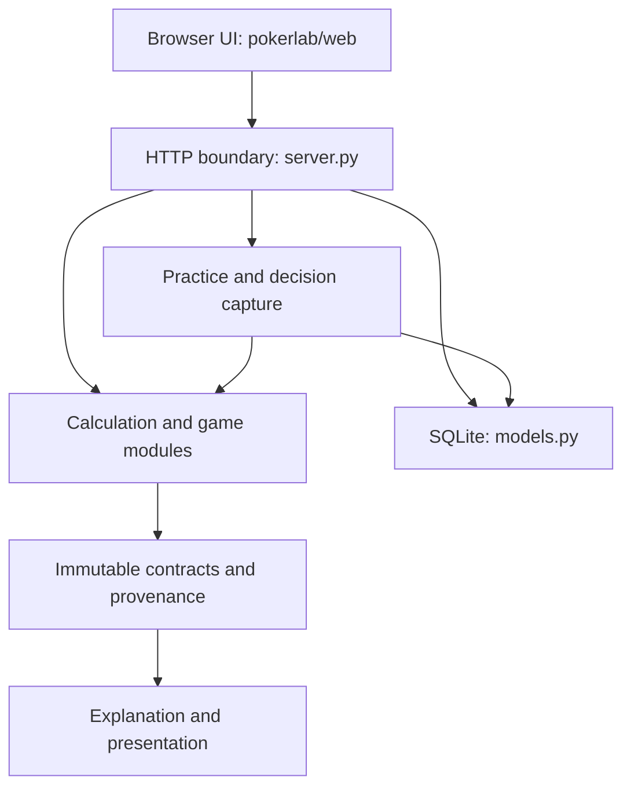

# System overview

This overview describes commit [`65c9ba7a9ddba67f2bababe51e4d6c5eed8696ce`](https://github.com/ajpaulson18-design/openpoker-lab/commit/65c9ba7a9ddba67f2bababe51e4d6c5eed8696ce). It maps the current implementation and links to the detailed contracts instead of restating them.

## Runtime shape

The Python server serves the browser assets and JSON endpoints. Equity and solve requests are calculated from request inputs; opponent records and decision reports use local SQLite persistence; live practice hands are held in server memory. `README.md` documents startup, endpoints, data handling and local-only access. `docs/architecture.md` documents the API and mathematical conventions.

## Module responsibilities

| Boundary | Main modules | Responsibility |
| --- | --- | --- |
| Cards and simulation | `cards.py`, `equity.py` | Parse cards/ranges, rank hands, draw weighted opponent hands, sample legal runouts, or enumerate exact heads-up river outcomes. |
| Transparent analysis | `analysis.py`, `exploit.py` | Compute one-decision EV and opponent-aware adapters. Analysis consumes supplied ranges; aggregate opponent stats do not reconstruct hidden cards. |
| Solver | `solver.py`, `restricted_solver.py`, `river_config.py`, `river_tree.py`, `cfr.py`, `equilibrium.py` | Build finite river abstractions, train strategies, expose strategy contracts and compute information-set best responses. |
| Shared postflop solver | `postflop_solver.py`, `turn_solver.py`, `planned_cfr.py`, `public_cfr.py` | Extend configured games across flop/turn/river reveals; recursive CFR is reference, with bounded optional Python traversal backends. |
| Persistent model | `models.py`, `contracts.py` | Store counted observations and priors, return immutable snapshots, and define structured result/evidence boundaries. |
| Practice and review | `game.py`, `practice.py`, `server.py`, `decision_study.py` | Run hand mechanics, capture decision-time state, preserve replay inputs and summarize reviewable decisions. Decision capture logic lives in `practice.py` and `server.py`; no `decision_capture.py` module exists. |
| Explanation and coaching | `explanations.py`, `personalities.py`, `coach_analysis.py`, `coach_grounding.py`, `coach_provider.py`, `coach_conversation.py`, `coach_teaching.py`, `situation_teaching.py` | Turn completed structured results into grounded facts and deterministic explanation. The optional external provider selects a validated reply plan; the local renderer creates the response. Bounded multi-turn coaching is implemented. |
| Transport and client | `server.py`, `web/` | Validate local HTTP requests, enforce JSON boundaries and concurrency limits, and render the interface. |

This is a responsibility map, not a claim that every request traverses every module. In particular, explanation/presentation follows calculation, while independent equity and solver endpoints need not touch the opponent store.

## Solver and probability contracts

### Equity and simulation

`equity.simulate` accepts one to five opponent ranges and returns pot-share equity (ties split), win/tie rates, a 95% interval, standard error, exactness, seed, range-combination counts and hero hand categories. With a complete five-card board and exactly one opponent range, it enumerates every weighted legal opponent hand exactly. Other cases use seeded Monte Carlo. Each opponent hand is sampled independently from its weighted range; the joint deal is rejected if any private cards collide. This preserves the product of supplied range weights rather than sequentially renormalizing ranges. After private cards are selected, a uniformly sampled legal runout completes the board. The reported interval captures sampling error under those inputs; it says nothing about whether the entered ranges are correct. These meanings are implemented in `pokerlab/equity.py` and exercised by `tests/test_core.py`.

`analysis.analyze` is a distinct one-decision model. Facing a bet it compares fold with call using the supplied betting range. With no call outstanding it compares check with a bet using separate fold-rate and continuation-range inputs; absent continuation range, checkers and callers are assumed to share the same range. It excludes rake, raises, stack caps and future betting. Pre-river equity is a checkdown estimate. The 45% fold baseline is a scenario, not a solver output. See the formulas and caveats in [architecture.md](../architecture.md) and README “Equity and decision analysis.”

### CFR solvers

The fixed-board river solver enumerates compatible weighted private-hand pairs and solves the configured finite betting tree with full traversal. The historical compatibility path has one fixed bet size and no raises. The configured path adds bounded bet/raise sizes, effective stacks, all-ins and finite raise depth. Strategies are private-hand/public-history information sets. Vanilla CFR is the default; DCFR is optional. Reported NashConv and exploitability are exact best-response gaps for the reported average strategy in that finite game, subject to floating-point arithmetic. A low gap does not extend the game to missing bet sizes or streets. Node locks change the strategy profile; the unrestricted gap then describes exploitability of that profile and does not certify convergence in the constrained game.

The shared postflop API starts on a flop, turn or river. It preserves ordered physical reveals and evaluates each static compatible private-hand/runout world; a policy cannot see future cards early. Optional selected runouts filter the entire joint world distribution before one global normalization. Therefore they define a conditional study game and can change private-pair probabilities through blockers. Recursive traversal is the reference; planned traversal prepares bounded static operations; public-batched traversal shares exact work across private hands while retaining sparse physical world edges. The latter two are Python implementations, not native compilation or chance sampling. Strict candidate/world/tree/edge limits make broad full-deck flop games impractical. No preflop or multiway equilibrium solver is implemented.

Use the detailed solver references for exact actions, formulas, validation fixtures, resource caps and benchmark provenance: [river validation](../solver-validation.md), [configured river semantics](../configured-river-validation.md), [turn/rivers](../turn-river-validation.md), [postflop validation](../postflop-validation.md), [planned traversal](../planned-traversal.md), and [public-batched CFR](../public-batched-cfr.md).

## Opponent observations and decision-time state

`models.py` keeps tendencies independently, with explicit opportunities and Beta priors. Snapshots are immutable and can be filtered by street/context; repeated observation IDs are idempotent and conflicting reuse is rejected. These rates are evidence summaries rather than a learned joint behavioral policy. Aggregate fold-to-bet rates do not determine a caller's hidden-card range, and shown bluff rates have selection bias. The analysis path requires explicit ranges and records provenance instead of silently converting tendencies into card frequencies.

Practice decisions capture ranges and relevant model snapshot at decision time so saved analysis can be replayed after the live opponent model changes. The hand engine supports 2–6 seats, integer chips, short all-ins, side pots, returned uncalled excess and deterministic seeded deals. Check the implementation contracts and regressions in `models.py`, `practice.py`, `server.py`, `decision_study.py`, `game.py`, and their corresponding `tests/test_opponent_model.py`, `tests/test_practice.py`, `tests/test_decision_capture.py`, `tests/test_decision_study.py`, and `tests/test_core.py`.

## Validation index

The existence of the checks below is source-verifiable at this baseline; this overview does not claim they were executed here.

| Validation target | Tests or scripts | What the checks target |
| --- | --- | --- |
| Evaluator, ranges, equity, EV, settlement | `tests/test_core.py`; `scripts/validate_evaluator.py` | Known hand categories/ranking, range sizes and blockers, ties, weighted river equity, deterministic seeded simulation, collisions and game rules. |
| River strategy math | `tests/test_solver_validation.py`, `tests/test_solver_variants.py` | Independent utility/deal evaluation, brute-force pure best responses, known small-game CFR references and deterministic/convergence properties. |
| Configured action trees | `tests/test_configurable_solver.py`, `tests/test_postflop_river_compatibility.py` | Sizing, raise semantics, stacks, all-ins, parity/compatibility and strategy behavior. |
| Physical postflop chance and policy visibility | `tests/test_turn_solver.py`, `tests/test_postflop_solver.py`, `tests/test_public_postflop.py` | Weighted/blocker-conditioned worlds, ordered reveals, policy replay, hidden future cards, best responses and street accounting. |
| Traversal and resource limits | `tests/test_planned_cfr.py`, `tests/test_public_cfr.py`, `tests/test_cfr_lifetime.py`, `tests/test_postflop_budget.py` | Backend agreement on fixtures, caps, edge conditions and closure lifetime. |
| Persistence, replay and privacy | `tests/test_opponent_model.py`, `tests/test_practice.py`, `tests/test_decision_capture.py`, `tests/test_decision_study.py` | Evidence contracts, duplicate handling, reproducible decision inputs, hidden-card exclusion, transaction behavior and review. |
| Explanations and coaching | `tests/test_explanations.py`, `tests/test_coach_grounding.py`, `tests/test_coach_analysis.py`, `tests/test_coach_teaching.py`, `tests/test_personalities.py`, `tests/test_coach_provider.py`, `tests/test_coach_conversation.py`, `tests/test_current_coach.py`, `tests/test_current_coach_conversation.py`, `tests/test_coach_request.py` | Structured fact grounding, deterministic outputs, protected result invariants, bounded conversation and visibility. |
| HTTP and browser | `tests/test_core.py`, `tests/test_practice.py`, `scripts/test_frontend.cjs` | Endpoint behavior, local access checks and frontend contract checks. |

Historical run counts and timings are documented in the relevant detailed docs and benchmark JSON. They remain tied to the source hash, interpreter, harness and fixtures recorded there. For current-baseline claims, run the commands in `AGENTS.md` and record their actual outcomes against a full commit SHA; the audit that produced this overview ran no tests.
